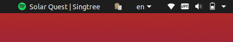
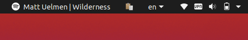
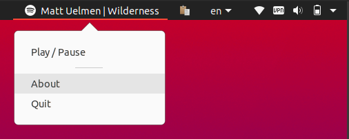

# Spotify Indicator

Shows currently playing song on [Spotify for Linux](https://www.spotify.com/us/download/linux/):

Playing:  

Paused:  

Menu:  

Features:
 - scroll up/down on the icons plays next/previous song
 - toggle playback by clicking on the menu item
 - icon color shows the playback status: green - playing, white - paused.
 
## Installation

Install [sp](https://gist.github.com/wandernauta/6800547) - script to control spotify playback.
Then clone the repo and execute install.sh with sudo priviledge.
Then simply run `spotify-indicator`. To start the script automatically add it to the the list of startup applications.